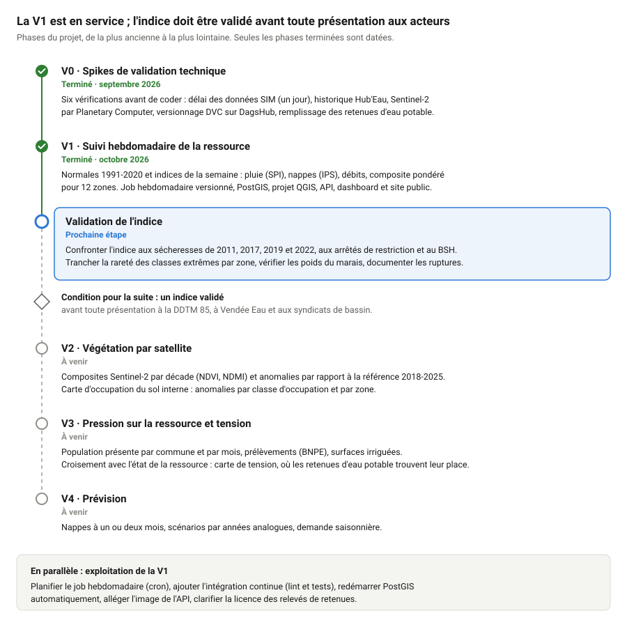

# Observatoire de la sécheresse

Suivi hebdomadaire de la sécheresse à l'échelle d'un département, **par zone hydrogéologique** : nappes, débits des cours d'eau, écoulement observé (ONDE), pluie (SIM de Météo-France) et remplissage des retenues d'eau potable, puis, à terme, télédétection Sentinel-2 et occupation du sol. Instance de référence : **Vendée (85)**, découpée en 12 zones.

Les résultats sont des **indices standardisés** classés sur 7 niveaux (de « très bas » à « très haut »), calculés chaque semaine ISO, par station et par zone, ainsi qu'un **indice composite** par zone. Ils sont consultables dans un **dashboard web**, dans **QGIS** et par une **API**.

**Voir le dashboard public : <https://baptistefeldmann.github.io/observatoire-secheresse/>** (prototype : l'indice est en cours de validation).

> État : V1 terminée et en service depuis octobre 2026 (indices hebdomadaires de 1991 à aujourd'hui, job hebdomadaire, base PostGIS, projet QGIS, API, dashboard et sa version publique). Prochaine étape : valider l'indice sur les sécheresses passées. Voir la [feuille de route](#10-feuille-de-route) ; détail dans [`passation.md`](passation.md).

## Sommaire

1. [Ce que produit l'observatoire](#1-ce-que-produit-lobservatoire)
2. [Architecture](#2-architecture)
3. [Installation](#3-installation)
4. [Utilisation](#4-utilisation)
5. [Les données en base](#5-les-données-en-base)
6. [Utiliser l'observatoire dans QGIS](#6-utiliser-lobservatoire-dans-qgis)
7. [L'API et le dashboard](#7-lapi-et-le-dashboard)
8. [Adapter à un autre département](#8-adapter-à-un-autre-département)
9. [Arborescence et documentation](#9-arborescence-et-documentation)
10. [Feuille de route](#10-feuille-de-route)
11. [Licence](#11-licence)

## 1. Ce que produit l'observatoire

### Pourquoi des zones

Un département n'est pas homogène. En Vendée, les nappes du Sud-Vendée sédimentaire réagissent lentement, celles du bocage sur socle réagissent vite et sont peu suivies, les marais et les îles ont leur propre fonctionnement. Les outils existants (Info-Sécheresse, bulletin de situation hydrologique, VigiEau) donnent une lecture par station, mensuelle ou administrative. L'observatoire lit le territoire **zone par zone**, chaque semaine, avec une méthode publiée ([`docs/methodologie.md`](docs/methodologie.md)).

Les zones sont des unions de masses d'eau souterraine, éventuellement découpées par les zones d'alerte sécheresse (décision D5). La Vendée en compte 12 : Sud-Vendée, marais poitevin, marais breton, île de Noirmoutier, île d'Yeu, et 7 sous-zones du bocage par bassin versant.

### Les indices

Chaque variable est comparée **à sa propre normale** (même station ou même zone, même période de l'année, référence 1991–2020), puis ramenée sur une échelle commune. On ne mélange jamais de valeurs brutes.

| Indice | Variable | Échelle | Principe |
|---|---|---|---|
| `spi_1`, `spi_3`, `spi_6` | pluie sur 1, 3 et 6 mois | zone | Indice de précipitations standardisé (loi gamma) |
| `ips` | niveau des nappes | piézomètre, puis zone | Niveau moyen du mois comparé aux mêmes mois de la référence (méthode BRGM) |
| `debit` | débit des cours d'eau | station, puis zone | Débit moyen sur 7 jours comparé aux mêmes dates de la référence |
| composite | les trois ci-dessus | zone | Moyenne pondérée de `spi_3`, `ips` et `debit`, poids propres à chaque zone |
| `onde` | écoulement observé | zone | Part des stations ONDE en assec ou sans écoulement visible, par campagne (non standardisée, hors composite) |
| retenues | remplissage des retenues d'eau potable | retenue | Volume / capacité, chaque semaine (affiché à part, hors composite) |

Les valeurs standardisées se lisent comme un écart à la normale (0 = normal, −1,28 ou moins = très sec, environ une semaine sur dix) :

| Classe | Libellé | Valeur standardisée |
|---|---|---|
| 1 | Très bas / extrêmement sec | ≤ −1,28 |
| 2 | Bas / modérément sec | −1,28 à −0,84 |
| 3 | Modérément bas | −0,84 à −0,25 |
| 4 | Normal | −0,25 à 0,25 |
| 5 | Modérément haut | 0,25 à 0,84 |
| 6 | Haut | 0,84 à 1,28 |
| 7 | Très haut / extrêmement humide | > 1,28 |

Quelques règles utiles pour lire les résultats :

- **Fraîcheur des nappes** (D1) : un piézomètre dont la dernière mesure a plus de 45 jours reste affiché, mais n'entre pas dans le composite de la semaine. En Vendée, les piézomètres sont publiés par lots : l'IPS manque souvent au composite du marais breton.
- **Composante absente** : ses poids sont répartis sur les autres. Le composite indique combien de composantes il utilise (`n_composantes`) et s'il est partiel (`partiel`).
- **Stations à fonctionnement modifié** (D8) : certains piézomètres ont changé de régime (travaux, prélèvements). Leur normale ne porte que sur le nouveau régime, ou ils n'ont pas d'IPS (Noirmoutier, jusqu'en 2028).
- **Historique** : les semaines passées sont recalculées avec les données publiées depuis, plus complètes que ce qui était disponible sur le moment.

## 2. Architecture

```
  SOURCES (API ouvertes)
  Hub'Eau piézométrie · hydrométrie · écoulement ONDE
  Météo-France SIM (data.gouv.fr) · retenues (ArcGIS du Département)
  SANDRE (masses d'eau, zones d'alerte) · geo.api.gouv.fr (communes)
                 │
                 ▼
  PIPELINE PYTHON  (python -m pipeline <commande>, appelé par make)
  référentiels → ingestion → normales → indices de la semaine
                 │
                 ▼
  data/  GeoParquet, SOURCE DE VÉRITÉ          versionné par DVC → DagsHub
  referentiels/ · raw/ · normales/ · indices/
                 │  make db-rebuild (une transaction, reconstruction complète)
                 ▼
  PostGIS (Docker)  COUCHE DE SERVICE          reconstructible à tout moment
  tables ref · obs · idx · rst, vues carto, projet QGIS
        │                         │
        ▼                         ▼
  QGIS (rôle lecteur,        API FastAPI, port 8010 ── dashboard web (/dashboard/)
  tunnel SSH si distant)     (rôle lecteur)            MapLibre + ECharts
                                  │
                                  ▼  make site / make pages (export statique)
                             GitHub Pages : dashboard public, sans API ni base
```

### Principes

- **Les fichiers de `data/` font foi.** PostGIS n'est qu'une copie de service : `uv run dvc pull` suivi de `make db-rebuild` la reconstruit à l'identique. On n'écrit jamais une donnée seulement en base.
- **Versionnage** : le code dans Git (GitHub), les données tabulaires dans DVC (remote DagsHub), un fichier par source et par année pour que chaque semaine ne modifie que les fichiers de l'année en cours. Les rasters Sentinel-2 (V2) sont régénérables et ne sont pas versionnés.
- **Idempotence** : relancer une étape sur les mêmes données réécrit des fichiers identiques au bit près. Une valeur corrigée à la source remplace l'ancienne ; une valeur inchangée garde sa date d'ingestion.
- **Robustesse** : une station ou une source en échec est consignée sans bloquer les autres.
- **CRS** : tout est stocké et calculé en Lambert 93 (EPSG:2154).
- **Généricité** : le code ne contient aucune référence au territoire, tout passe par `config/` (section 8).

### Les étapes du pipeline

| Étape | Commande | Module | Produit |
|---|---|---|---|
| Référentiels | `make referentiels` | `pipeline/referentiels.py`, `pipeline/zonage.py` | communes, zones, mailles SIM, stations rattachées à leur zone |
| Ingestion | `make ingest` | `pipeline/ingestion.py`, `pipeline/sources/` (un module par source) | `data/raw/<source>/<prefixe>_<annee>.parquet` |
| Normales | `make reference` | `pipeline/reference/` | `data/normales/` : paramètres du SPI, échantillons de référence de l'IPS et des débits, enveloppes (minimum, médiane, maximum), ruptures détectées |
| Indices | `make indices` | `pipeline/indices/` | `data/indices/` : indices par station, par zone, composite |
| Validation | `make validation` | `pipeline/validation/`, `pipeline/sources/vigieau.py` | `data/validation/` : arrêtés sécheresse (VigiEau) et niveau de restriction par zone et par semaine ; rapport [`docs/validation.md`](docs/validation.md) |
| Base | `make db-rebuild` | `pipeline/db/` (migrations Alembic) | PostGIS rechargé depuis `data/` |
| Projet QGIS | `make qgis` | `qgis/construire_projet.py` (QGIS en Docker) | `qgis/secheresse_<slug>.qgz` et `qgis/styles/`, chargés dans PostGIS |
| Site public | `make site`, `make pages` | `api/export.py` | `build/pages/`, publié sur la branche `gh-pages` (GitHub Pages) |
| Job hebdomadaire | `make hebdo` | `pipeline/run_hebdo.py`, `pipeline/publication.py` | ingestion des 90 derniers jours → indices → DVC et Git → PostGIS → rapport |

Les paramètres métier (périodes, seuils, fenêtres, pondérations) sont dans `config/*.yaml`, jamais dans le code.

## 3. Installation

Prérequis : [uv](https://docs.astral.sh/uv/), Docker, make. Sur une machine Linux.

```bash
git clone https://github.com/baptistefeldmann/observatoire-secheresse.git
cd observatoire-secheresse
cp .env.example .env      # renseigner au minimum POSTGRES_PASSWORD et POSTGRES_LECTEUR_PASSWORD
make install              # environnement Python (uv sync)
make config               # vérifie la configuration du territoire
make up                   # démarre PostGIS (port 5433) et l'API (port 8010), limités à la machine
```

Ensuite, deux possibilités.

**Récupérer les données déjà calculées** (recommandé, quelques secondes) :

```bash
make dvc-auth             # identifiants DagsHub (DAGSHUB_USER, DAGSHUB_TOKEN dans .env)
uv run dvc pull           # récupère data/ depuis DagsHub
make db-rebuild           # charge PostGIS (environ 1 min)
```

**Tout recalculer depuis les API** (environ 12 min) :

```bash
make ingest               # référentiels + historique complet (~10 min)
make reference            # normales (~20 s)
make indices              # indices de 1991 à la dernière semaine complète (~25 s)
make db-rebuild
make validation           # indices confrontés aux arrêtés sécheresse -> docs/validation.md (~5 s)
```

PostGIS ne redémarre pas seul : après un redémarrage de la machine, relancer `make up`.

## 4. Utilisation

```bash
make help                 # liste des commandes
make config               # affiche territoire, période de référence, zones et pondérations
make test                 # tests sans réseau ni service externe
make test-db              # test d'intégration sur une base PostGIS jetable (Docker)
make lint                 # ruff + mypy strict
```

### Le job hebdomadaire

```bash
make hebdo
```

Il traite la dernière semaine ISO complète, en 3 minutes environ :

1. **Ingestion** des 90 derniers jours pour toutes les sources, afin de capter les corrections faites à la source. Un piézomètre publié par lots est relu depuis sa dernière mesure en stock.
2. **Indices** de tout l'historique. Une correction reçue se répercute ainsi sur toutes les semaines concernées.
3. **Publication** : `dvc add` et `dvc push` de `data/raw` et `data/indices`, commit des seuls fichiers `data/raw.dvc` et `data/indices.dvc` (« Données AAAA-Www »), étiquette `data-AAAA-Www`, puis envoi sur GitHub.
4. **Rechargement** de PostGIS.
5. **Rapport** dans `logs/hebdo/AAAA-Www.md` (non versionné) : stations en échec, anomalies de valeur, données disponibles pour la semaine, composite par zone, publication.

Relancer le job sur la même semaine ne change rien si les sources n'ont pas changé : pas de nouveau commit, et l'étiquette reste en place. Si des données ont été corrigées entre-temps, un nouveau commit est créé et l'étiquette de la semaine est déplacée dessus.

Points à connaître avant de le lancer :

- Le dépôt doit être sur `main` (`hebdo.branche` dans `config/projet.yaml`). Sinon, les données sont envoyées sur DagsHub, mais il n'y a ni commit ni étiquette, et le rapport le signale.
- Votre travail en cours, indexé ou non, n'entre jamais dans le commit de données. En revanche, `git push` envoie aussi vos commits locaux de `main` qui ne sont pas encore poussés.
- `make hebdo` attend la clé SSH GitHub et les identifiants DagsHub (`make dvc-auth`) de la machine. Pour tester sans rien versionner : `uv run python -m pipeline hebdo --sans-publication`.

**Exécution automatique** (non installée pour l'instant). Le SIM de la veille est publié vers 10 h, heure de Paris, et la machine doit être allumée au moment du lancement. Ligne à ajouter avec `crontab -e`, en remplaçant le chemin du dépôt :

```
0 11 * * 1  cd /chemin/du/depot && mkdir -p logs/hebdo && PATH=$HOME/.local/bin:/usr/bin:/bin make hebdo >> logs/hebdo/cron.log 2>&1
```

### Calculs à la demande

Les indices d'une plage de semaines seulement :

```bash
uv run python -m pipeline indices --debut 2026-W27 --fin 2026-W39
```

Le résultat est identique à celui d'un calcul complet. Les semaines recalculées remplacent les anciennes, les autres sont conservées.

Après une mise à jour des données, les versionner :

```bash
uv run dvc add data/raw data/indices
uv run dvc push
```

## 5. Les données en base

La base `secheresse_<slug>` (ici `secheresse_vendee`) comporte quatre schémas de tables et un schéma de vues (`carto`). QGIS et le dashboard s'y connectent avec le rôle **`lecteur`**, en lecture seule.

| Table | Contenu | Géométrie |
|---|---|---|
| `ref.zone` | les 12 zones, leurs pondérations (`ponderations`, JSON) | multipolygone |
| `ref.station` | 140 stations : `source` = `piezo`, `hydro`, `onde` ou `retenue`, `zone_id` de rattachement | point |
| `ref.commune` | communes du département | multipolygone |
| `ref.maille_safran` | mailles SIM de 8 km | polygone |
| `obs.piezo_jour` | niveaux journaliers des nappes (`niveau_ngf`, `profondeur`) | — |
| `obs.debit_jour` | débits moyens journaliers (`qmj_ls`, en l/s) | — |
| `obs.onde` | observations ONDE (`modalite` : 1 visible, 1a acceptable, 1f faible, 2 non visible, 3 assec) | — |
| `obs.meteo_jour` | pluie, ETP, humidité du sol par maille SIM | — |
| `obs.retenue_semaine` | volume et capacité des retenues (m³) | — |
| `idx.indice_station` | IPS et débit par station et semaine : `valeur`, `classe`, `date_mesure`, `dans_composite`, `hors_reference` | — |
| `idx.indice_zone` | SPI, IPS, débit et ONDE par zone et semaine, `n_stations`, `detail` (JSON) | — |
| `idx.composite_zone` | composite par zone et semaine, `detail` (composantes, poids appliqués, `partiel`) | — |
| `rst.produit` | catalogue des rasters Sentinel-2 (V2, vide) | emprise |
| `idx.enveloppe_station` | enveloppe de la normale par station : minimum, médiane, maximum par mois (nappes, m NGF) ou par semaine (débits, Q7 en l/s) | — |
| `carto.v_composite_zone` | composite joint à sa zone : `debut` (lundi), `fin` (dimanche), `n_composantes`, `partiel`, `manquantes`, `derniere` | multipolygone |
| `carto.v_indice_zone` | SPI, IPS et débit par zone, mêmes colonnes de semaine | multipolygone |
| `carto.v_onde_zone` | campagnes ONDE par zone : `date_campagne`, `pct_sans_ecoulement`, `n_assec`, `n_rupture`, `derniere` (dernière campagne de la zone) | multipolygone |
| `carto.v_indice_station` | IPS et débit par station, `anciennete_jours` de la mesure | point |
| `carto.v_retenue` | relevés des retenues, `remplissage_pct`, `derniere` (dernier relevé) | point |

Toutes les tables d'indices ont une colonne `semaine` au format `AAAA-Www` (ex. `2026-W39`) et une colonne `version_methodo` (identifiant de la dernière décision de méthode, ex. `D9`). Les tables d'indices n'ont pas de géométrie : les vues `carto` les joignent à leur zone ou à leur station. Leur colonne `derniere` repère la semaine la plus récente, et `debut` sert au contrôleur temporel de QGIS. Chaque vue a une clé unique `cle`.

## 6. Utiliser l'observatoire dans QGIS

Le projet QGIS est **rangé dans PostGIS** (table `carto.qgis_projects`). Un poste distant l'ouvre par le tunnel SSH, comme les données : il n'a besoin ni d'une copie du dépôt, ni de copier de fichier. Toutes les couches lisent la base par le **service** `secheresse_<slug>`, sans hôte ni mot de passe dans le projet.

Le projet est généré sur la machine Linux par `make qgis` (section 6.2). Le fichier `qgis/secheresse_<slug>.qgz` est versionné et fait foi ; `make qgis` et `make db-rebuild` le chargent en base.

### 6.1 Se connecter (une fois par poste)

**Sur la machine Linux qui héberge PostGIS :**

1. Copier `qgis/pg_service.conf.example` en `~/.pg_service.conf`.
2. Créer `~/.pgpass` (droits `600`) avec la ligne :
   ```
   localhost:5433:secheresse_vendee:lecteur:<POSTGRES_LECTEUR_PASSWORD>
   ```

**Depuis un autre poste (Windows)** : même principe, à travers un tunnel SSH. La procédure complète (tunnel, `PGSERVICEFILE`, `pgpass.conf`) est dans [`docs/acces_distant.md`](docs/acces_distant.md).

**Dans QGIS** : Explorateur › PostgreSQL › clic droit › Nouvelle connexion. Nom `secheresse_vendee`, champ **Service** = `secheresse_vendee`, laisser hôte, port, base et authentification vides. Cocher la case qui autorise le chargement des projets QGIS depuis la base, puis « Tester la connexion ».

**Ouvrir le projet** (à chaque session, PostGIS démarré et tunnel ouvert) : Projet › Ouvrir depuis › PostgreSQL, connexion `secheresse_vendee`, schéma `carto`, projet `secheresse_vendee`.

### 6.2 Générer le projet (machine Linux)

```bash
make qgis
```

La commande lance le script [`qgis/construire_projet.py`](qgis/construire_projet.py) dans QGIS 3.44 en Docker (image `qgis/qgis:3.44.8`, environ 2 Go une fois installée, téléchargée au premier lancement). Le script se connecte avec le rôle `lecteur` et lit `config/` (territoire, palette des classes). Il écrit ensuite `qgis/secheresse_vendee.qgz` et `qgis/styles/*.qml`, puis charge le projet en base. Cela prend environ 20 secondes. Il s'arrête avec un message explicite si une couche ne se connecte pas.

À relancer après un changement des couches, des styles ou de la palette (`config/classes.yaml`), puis versionner `qgis/`. Inutile après `make hebdo` : le projet lit toujours la base, et le groupe « Dernière semaine » suit seul les nouvelles semaines.

Garder la version de l'image (`QGIS_IMAGE` dans le `Makefile`) égale ou inférieure à celle des postes : un projet enregistré par une version plus récente s'ouvre avec un avertissement.

### 6.3 Contenu du projet

| Groupe | Couches | Affichage |
|---|---|---|
| **Dernière semaine** | piézomètres (IPS), stations hydrométriques (débit), retenues (% de remplissage), indice composite par zone ; masquées par défaut : SPI 3 mois, IPS et débit par zone, dernière campagne ONDE | se met à jour seul à chaque `make hebdo` |
| **Historique (contrôleur temporel)** | composite, piézomètres, stations hydrométriques, ONDE, retenues | masqué ; voir 6.4 |
| **Référentiels** | zones (contours et noms) ; masquées : stations par source, communes, mailles SIM | |
| **Fond** | OpenStreetMap | demande un accès à Internet |

Lecture des symboles :

- **Classes 1 à 7** : palette du bulletin de situation hydrologique, du rouge (très bas) au bleu foncé (très haut), en passant par le vert (normal). Les couleurs viennent de `config/classes.yaml`.
- **Piézomètres** : rond plein s'il entre au composite de la semaine, simple contour si sa dernière mesure a plus de 45 jours (D1). La table attributaire donne `date_mesure` et `anciennete_jours`.
- **Composite** : `n_composantes`, `partiel` et `manquantes` dans la table attributaire indiquent les composantes absentes.
- **ONDE** : part des stations sans écoulement à la dernière campagne de la zone (`date_campagne`), du jaune pâle (0 %) au brun (100 %).
- **Retenues** : remplissage du dernier relevé, du rouge (moins de 20 %) au bleu (plus de 80 %).

### 6.4 Parcourir l'historique

1. Masquer le groupe « Dernière semaine » et cocher une couche du groupe « Historique ».
2. Ouvrir le contrôleur temporel : Vue › Panneaux › Contrôleur temporel, puis cliquer sur « Navigation animée » (icône de lecture).
3. Le pas est d'une semaine, de 1991 à la date de génération du projet. Déplacer le curseur, ou saisir une date dans le champ de la plage, pour afficher la semaine qui la contient. Ex. : 15 août 2022 pour la sécheresse de 2022.

Sans le contrôleur temporel, une couche du groupe « Historique » affiche toutes les semaines superposées : ne la cocher qu'avec la navigation activée.

### 6.5 Ajouter une couche à la main

Toutes les vues `carto` (section 5) se chargent depuis l'Explorateur : PostgreSQL › `secheresse_vendee` › `carto`. Pour se limiter à la dernière semaine : clic droit › Filtrer…, `"derniere"`. Pour un indice : `"indice" = 'spi_3' AND "derniere"`. Pour une semaine donnée : `"semaine" = '2022-W33'`. Les styles de `qgis/styles/` s'appliquent par Propriétés › Symbologie › Style › Charger le style.

Pour une requête SQL libre : Base de données › Gestionnaire BD, fenêtre SQL, « Charger en tant que nouvelle couche ».

### 6.6 Séries temporelles

Les tables `idx.indice_zone`, `idx.composite_zone` et `obs.*` se chargent comme tables sans géométrie. Ouvrir la table attributaire et filtrer, par exemple `"zone_id" = 'SUD_VENDEE' AND "indice" = 'spi_3'`. L'extension **DataPlotly** trace alors la courbe (`semaine` en abscisse, `valeur` en ordonnée). Pour une chronique brute, utiliser `obs.piezo_jour` ou `obs.debit_jour` filtrée sur un `station_id`.

### 6.7 Bonnes pratiques

- Toujours se connecter par le service, avec le rôle `lecteur` : aucun mot de passe ne doit apparaître dans un projet QGIS versionné.
- La base est entièrement reconstruite par `make db-rebuild` : ne rien y écrire depuis QGIS (le rôle `lecteur` l'interdit de toute façon), et ne pas y stocker de couche personnelle.
- Après un `make hebdo` ou un `make db-rebuild`, recharger les couches (F5) pour voir la nouvelle semaine.
- Modifier les couches ou les styles dans le script plutôt qu'à la main dans le projet : sinon, la prochaine génération écraserait ces modifications. Le rôle `lecteur` ne peut de toute façon pas enregistrer le projet en base : pour une version personnelle, Projet › Enregistrer sous… dans un fichier local.

## 7. L'API et le dashboard

L'API sert les indices au dashboard (étape 9) et à tout autre client, en lecture seule (rôle `lecteur`). Elle tourne dans le service `api` de `docker-compose.yml` : `make up` démarre PostGIS et l'API, et reconstruit l'image si le code a changé ; `make down` arrête les deux. Elle écoute sur le port **8010**, limité à la machine. Depuis le portable, elle est accessible par le tunnel SSH, déjà configuré pour ce port : <http://localhost:8010/docs> donne la documentation interactive, où l'on peut essayer chaque requête.

| Requête | Réponse |
|---|---|
| `GET /` | territoire, version de la méthode, dernière semaine calculée |
| `GET /classes` | seuils, libellés et couleurs des 7 classes (légende) |
| `GET /semaines` | semaines disponibles, de la plus récente à la plus ancienne |
| `GET /zones?semaine=` | zones en GeoJSON (WGS84, contours simplifiés à 20 m) avec l'indice composite de la semaine (la dernière par défaut) |
| `GET /zones/{zone_id}/series?indice=&debut=&fin=` | série hebdomadaire d'un indice de zone : `composite` (défaut), `spi_1`, `spi_3`, `spi_6`, `ips`, `debit`, `onde` |
| `GET /stations?source=&semaine=` | stations en GeoJSON : indice de la semaine (piézomètres, stations hydrométriques), dernier relevé (retenues) ou dernière observation (ONDE) |
| `GET /stations/{station_id}/series?debut=&fin=` | chronique brute (niveau, débit, remplissage, modalité ONDE), indices hebdomadaires et enveloppe de la normale (minimum, médiane, maximum) |
| `GET /semaines/{semaine}/synthese` | synthèse départementale : composite par zone et répartition des classes, stations, dernières campagnes ONDE, remplissage total des retenues comparé aux années précédentes |
| `GET /sante` | disponibilité de la base |

Exemples : `/zones/SUD_VENDEE/series?indice=spi_3&debut=2022-W01&fin=2022-W52`, `/stations/piezo:05634X0013/SF3/series?debut=2026-01-01`. Les semaines sont des semaines ISO (`AAAA-Www`), les dates au format `AAAA-MM-JJ`. Un paramètre invalide renvoie une erreur 422 qui l'explique.

### Le dashboard

<http://localhost:8010/dashboard/> (tunnel ouvert depuis le portable). Il est servi par l'API, donc démarré par `make up`.

- **En haut** : choix de la semaine (flèches, champ semaine, bouton « Dernière ») et chiffres clés : zones en classe 1-2, remplissage des retenues comparé aux années précédentes, stations de débit en classe 1-2, piézomètres au composite, part des stations ONDE sans écoulement.
- **Carte** (fond Plan IGN) : zones colorées selon l'indice composite, piézomètres et stations de débit selon leur classe (anneau : piézomètre hors composite, mesure ancienne), retenues en carrés (remplissage), stations ONDE (case à cocher). Survol : valeur et classe ; clic : détail dans le panneau.
- **Panneau** : par défaut, la synthèse de la semaine (zones de la plus sèche à la plus humide, retenues, dernière campagne ONDE). Pour une zone : composantes et poids appliqués, courbe du composite colorée par classe, courbes des composantes, campagnes ONDE de l'année. Pour une station : chronique brute avec l'enveloppe de la normale (minimum, médiane, maximum ; débits en échelle logarithmique), puis l'indice hebdomadaire. Période : 1 an, 2 ans, 10 ans ou tout. Le bouton « Tableau » affiche les valeurs de chaque graphique.
- **Lien partageable** : l'adresse de la page contient la semaine et la zone ou la station choisie, par exemple `/dashboard/#semaine=2022-W33&zone=SUD_VENDEE`.

Fichiers : `dashboard/index.html`, `app.js`, `style.css`. Sans framework ni compilation : modifier un fichier, puis `make up` pour reconstruire l'image de l'API. MapLibre 6 et ECharts 6 sont chargés depuis jsDelivr (versions figées), les tuiles depuis la Géoplateforme de l'IGN : le poste qui affiche le dashboard doit avoir accès à Internet.

### Version publique (GitHub Pages)

Le dashboard existe aussi en version statique, sans API ni base, publiée sur GitHub Pages : <https://baptistefeldmann.github.io/observatoire-secheresse/>.

```bash
make site    # construit le site dans build/pages (environ 100 Mo, 80 s ; PostGIS démarré)
make pages   # make site, puis remplace la branche gh-pages de GitHub par le nouveau site
```

- `make site` interroge l'API en interne (`api/export.py`) : mêmes calculs que la version locale. Le site contient les contours (une fois), les indices et la synthèse de chaque semaine (un fichier par année), et les séries complètes de chaque zone et de chaque station. Le dashboard lit ces fichiers à la place de l'API.
- `make pages` publie un **seul commit** sur `gh-pages`, qui remplace le précédent : l'historique Git ne garde pas chaque export. À lancer après un `make hebdo` pour mettre le site à jour (rien n'est automatique).
- Première publication : GitHub › Settings › Pages › Build and deployment › Deploy from a branch › `gh-pages`, dossier `/ (root)`.
- La version publique affiche un **bandeau d'avertissement** (prototype en cours de validation) et porte une balise qui demande aux moteurs de recherche de ne pas l'indexer. Le texte de l'avertissement et les sources citées en pied de page sont dans `config/projet.yaml` (bloc `publication`).
- Les données publiées sont celles de l'API, retenues comprises. Hub'Eau, les données SIM, le SANDRE et le Plan IGN sont sous Licence Ouverte (source citée) ; la table des retenues du Département n'a pas de licence publiée.

## 8. Adapter à un autre département

Le code ne contient aucune référence au territoire : tout passe par `config/`.

1. Copier le dépôt (sans `data/`, qui est propre au territoire).
2. Dans `config/projet.yaml`, bloc `territoire` : `code_departement`, `nom`, `slug`.
   En outre-mer, remplacer aussi `crs` par la projection officielle locale.
3. Réécrire `config/zones.yaml` : zones de lecture du territoire et pondérations de l'indice composite.
   Vider ou adapter `config/stations.yaml` (raccordements de stations hydrométriques, ruptures de fonctionnement, source locale des retenues ; sans elle, la couche nationale des retenues est utilisée).
4. Dans `.env` : `COMPOSE_PROJECT_NAME`, `POSTGRES_DB` et, si plusieurs instances tournent sur la même machine, `POSTGRES_PORT`.
5. Créer un dépôt DagsHub pour le territoire et remplacer l'URL du remote : `uv run dvc remote modify origin url https://dagshub.com/<compte>/<depot>.dvc`, puis `make dvc-auth`.
6. Adapter `qgis/pg_service.conf.example` (nom du service `secheresse_<slug>`, base, port).
7. Dans `config/projet.yaml`, bloc `publication` : texte de l'avertissement et sources citées par la version publique du dashboard.
8. `make config` pour valider, puis `make ingest`, `make reference`, `make indices`, `make db-rebuild` et `make qgis`.
9. Examiner les ruptures signalées par `make reference` (journal et `data/normales/ruptures.parquet`) et inscrire celles qui sont confirmées dans `config/stations.yaml` (D8).

`classes.yaml` (échelle à 7 classes) et `sources.yaml` (points d'accès des API) sont communs à tous les départements.

## 9. Arborescence et documentation

```
config/      paramètres : territoire, zones et pondérations, classes, sources, stations
pipeline/    sources/ (une par API), reference/ (normales), indices/, db/ (PostGIS, Alembic)
tests/       tests pytest sur réponses API enregistrées (fixtures/), sans réseau
data/        GeoParquet, source de vérité (DVC) : referentiels/, raw/, normales/, indices/, validation/
qgis/        script de génération du projet, projet .qgz, styles QML, service PostgreSQL d'exemple
api/         API FastAPI (app.py, requêtes SQL, Dockerfile)
dashboard/   dashboard web (index.html, app.js, style.css), servi par l'API
rasters/     COG Sentinel-2 (V2), locaux et non versionnés
docker/      initialisation de PostGIS (rôle lecteur)
docs/        spécification, méthodologie, accès distant, feuille de route, comptes rendus de spikes
build/       site statique du dashboard (make site), régénérable, non versionné
logs/        rapports du job hebdomadaire, non versionnés
```

| Document | Contenu |
|---|---|
| [`docs/SPEC.md`](docs/SPEC.md) | spécification de référence : architecture, sources, schéma, méthode, phases V1 à V4 |
| [`docs/methodologie.md`](docs/methodologie.md) | décisions de méthode D1 à D9 et contrôles chiffrés (elles priment sur la spec) |
| [`docs/validation.md`](docs/validation.md) | indices confrontés aux arrêtés sécheresse, généré par `make validation` |
| [`docs/acces_distant.md`](docs/acces_distant.md) | QGIS, dashboard et API depuis un poste Windows par tunnel SSH |
| [`docs/roadmap.svg`](docs/roadmap.svg) | schéma de la feuille de route (section 10) |
| [`LICENSE`](LICENSE), [`LICENCE-DONNEES.md`](LICENCE-DONNEES.md) | licences du code et des données (section 11) |
| [`docs/spikes/`](docs/spikes/) | validations techniques de la V0 (SIM, Hub'Eau, Sentinel-2, DVC, retenues) |
| [`passation.md`](passation.md) | état d'avancement, erreurs corrigées, reste à faire |

## 10. Feuille de route



La V1 tourne chaque semaine. Avant d'aller plus loin, l'indice doit être confronté aux sécheresses connues : c'est la condition pour le présenter aux acteurs du territoire (DDTM 85, Vendée Eau, syndicats de bassin).

**Validation de l'indice (prochaine étape)**

- Comparer les classes de 2011, 2017, 2019 et 2022 aux arrêtés de restriction et au bulletin de situation hydrologique. Exemple qui la motive : la semaine du 15 août 2022, seules 6 zones sur 12 sont en classe 1 ou 2.
- Trancher la rareté des classes extrêmes dans les moyennes par zone (composite en classe 1 de 5,4 % à 11,8 % du temps pour 10 % attendus) : restandardiser ou documenter (décision D9).
- Vérifier les pondérations du marais et du Sud-Vendée, qui ne reposent encore sur aucun chiffre.
- Documenter l'origine des ruptures de Noirmoutier et du marais breton auprès du BRGM ou des gestionnaires, et examiner le piézomètre 05634X0013/SF3.

**Phases suivantes** (spécification, §2) : V2 ajoute la végétation par satellite (Sentinel-2, occupation du sol), V3 l'axe pression et la carte de tension, V4 la prévision. Le schéma de données et l'arborescence sont déjà prévus pour elles.

**Exploitation**, en parallèle : planifier le job hebdomadaire (ligne cron dans la section 4), intégration continue, redémarrage automatique de PostGIS, image de l'API allégée. La liste complète des points ouverts est dans [`passation.md`](passation.md).

## 11. Licence

- **Code** : licence MIT ([`LICENSE`](LICENSE)). Chacun peut réutiliser, modifier et redistribuer le code, en conservant la mention de l'auteur.
- **Données produites par l'observatoire** (indices, normales, zones) : [Licence Ouverte 2.0](https://www.etalab.gouv.fr/licence-ouverte-open-licence/), avec mention de la source.
- **Données des fournisseurs** : elles gardent leurs propres conditions. Les relevés de remplissage des retenues n'ont pas de licence publiée et ne sont pas couverts. Détail dans [`LICENCE-DONNEES.md`](LICENCE-DONNEES.md).
